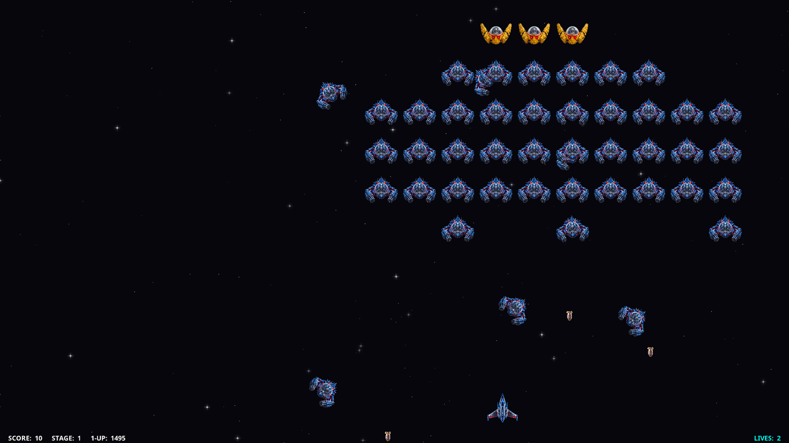

# Aliens Invaders

[](https://en.wikipedia.org/wiki/C%2B%2B20)
[](https://www.libsdl.org/)
[](LICENSE)
[](https://wayland.freedesktop.org/)
[](#how-to-enlist--compile)

<p align="center">
  
</p>

---

## Mission Briefing: Attention, Fellow Earthlings! 🌍🛸

Listen up, people of Earth.

While humanity was busy arguing on the internet, inventing coffees with way too much foam, and debating whether pineapple belongs on pizza, deep-space sensors picked up something alarming: **a massive extraterrestrial armada is descending upon our solar system.**

Why Earth? Our leading astrophysicists hypothesize they crossed three galaxies to seize our rare-earth minerals to fuel their quantum warp drives. Sociologists fear they simply want our global coffee supply. Cynics suspect they intercepted our daytime television broadcasts and concluded humanity was desperately overdue for a complete reboot.

**Are the aliens friendly?**
Let's put it this way: their diplomatic delegation arrived in synchronized wedge formation deploying high-yield plasma mortars. In universal interstellar etiquette, that translates roughly to: *"Hand over the planet; your eviction notice expired three minutes ago."*

Either way, you have just been promoted to Lead Planetary Interceptor Pilot (mostly because everyone else called in sick today). Your mission is simple:

1. **Climb into the cockpit** of an experimental Earth defense vessel.
2. **Blast through synchronized alien dive-bombing formations.**
3. **Grab tactical nuke warheads** and supercharged multi-cannons.
4. **Remind these extraterrestrial tourists** why they should have taken that left turn at Alpha Centauri.

Good luck, Pilot. The planet is counting on you (no pressure).

---

## Ship Hangar & Experimental Arsenal

Before launching into orbit, choose your combat vessel in the menu by pressing <kbd>T</kbd>:

- **The Cruiser (Standard Model):** The battle-hardened workhorse of Earth's defense fleet. Balanced aerodynamics, reinforced titanium hull, and high-frequency plasma cannons.
- **The Vanguard (Extra Prototype):** Next-generation experimental interceptor featuring swept-wing ion thrusters, tighter lateral drift, and high-visibility cockpit canopy.

### Battlefield Power-Ups:
- 🔵 **Speed Boost:** Overclocks sub-light maneuvering thrusters.
- 🔴 **Rapid Fire:** Maximizes plasma cannon cyclic rate of fire.
- 🟣 **Multi-Cannon:** Quad-plasma spread firing solution.
- 🟢 **Shield Matrix:** Restores reinforced electromagnetic shielding.
- 🟡 **Tactical Nuke:** Screen-clearing atomic blast that vaporizes all active hostiles in a flash of nuclear glory.

---

## Flight Controls

| Key | Tactical Action |
| :--- | :--- |
| <kbd>Space</kbd> | Fire Plasma Cannons |
| <kbd>←</kbd> / <kbd>→</kbd> | Maneuver Vessel Horizontally |
| <kbd>T</kbd> | Toggle Ship Model (*Cruiser* vs *Vanguard*) |
| <kbd>F</kbd> | Toggle Fullscreen (Scales up to native 4K UHD) |
| <kbd>1</kbd>, <kbd>2</kbd>, <kbd>3</kbd> | Preset Resolution Scales (`1280x720`, `1600x900`, `1920x1080`) |
| <kbd>-</kbd> / <kbd>+</kbd> | Adjust Particle Density (Level 0 OFF to Level 4 MAX) |
| <kbd>H</kbd> | Hall of Fame Leaderboards (Sector Breakdown & Global Legends) |
| <kbd>P</kbd> | Pause / Resume Combat |
| <kbd>S</kbd> | Launch Match (Start game) |
| <kbd>C</kbd> | Cheat Mode (Instant max firepower; disables leaderboard saving) |
| <kbd>Q</kbd> | Quit Combat or Return to Base |

---

## Local Arcade Hall of Fame (Multi-User)

*Aliens Invaders* honors the classic arcade spirit. On Linux systems, high scores are automatically saved to `/var/games/aliens-invaders.scores` with shared permissions (`0666`).

This means **every user account on your computer competes on the exact same local leaderboard**! Challenge your family, roommates, or coworkers for the ultimate high score bragging rights. If running portably without system install, scores gracefully save to your personal folder (`~/.local/share/aliens-invaders/scores`).

---

## How to Enlist & Compile

Built with modern **C++20** and native **SDL3**, the engine compiles effortlessly across all major operating systems:

### 1. Linux

Install build tools and the SDL3 development library:

- **Arch Linux / Manjaro:**
```bash
sudo pacman -S base-devel sdl3 pkgconf
```

- **Debian / Ubuntu / Linux Mint:**
```bash
sudo apt install build-essential libsdl3-dev pkg-config
```

- **Fedora / RHEL:**
```bash
sudo dnf install gcc-c++ make sdl3-devel pkgconfig
```

**Build and Install:**
```bash
make -j$(nproc)
sudo make install
```

---

### 2. FreeBSD

Native Clang with C++20 and SDL3:
```bash
sudo pkg install gmake sdl3 pkgconf
gmake -j$(sysctl -n hw.ncpu)
./build/aliens-invaders
```

---

### 3. macOS (Apple Silicon & Intel)

Prerequisites: Xcode Command Line Tools and Homebrew:
```bash
xcode-select --install
brew install sdl3 pkg-config
make -j$(sysctl -n hw.ncpu) CXX=clang++
./build/aliens-invaders
```

---

### 4. Windows (via MSYS2 / MinGW-w64)

Open the **MSYS2 UCRT64** terminal:
```bash
pacman -S mingw-w64-ucrt-x86_64-gcc \
          mingw-w64-ucrt-x86_64-sdl3 \
          mingw-w64-ucrt-x86_64-pkgconf \
          make
make -j$(nproc)
./build/aliens-invaders.exe
```

---

## Technical Highlights

- **Anti-Jitter Aerodynamics:** Centripetal Catmull-Rom parametric splines with vector low-pass filtering eliminate angular stair-stepping, producing silky-smooth curved flight paths.
- **Fair Play Anti-Scissor Ballistics:** Real-time trajectory prediction guarantees that converging bombs never trap the player in inescapable cross-fire corridors.
- **Sustained Interstellar Leap:** Relativistic warp speed light beams celebrate wave completion throughout the entire victory musical fanfare.
- **Astrophysical Deep Space:** Dynamic sector transitions between Cauchy cosmic filaments, Lin-Shu dual spiral arms, and Freeman exponential galactic disks.
- **Zero-Allocation Hot Loop:** Compile-time embedded binary textures and procedural audio synthesis in RAM ensure zero garbage-collection stuttering.

---

## Author & Copyright

**Claudio Fernandes de Souza Rodrigues**
*Lead Engine Architecture, C++20 / SDL3 Systems, Procedural Audio Synthesis, Aerodynamics & Gameplay.*
GitHub: [@claudiofsr](https://github.com/claudiofsr)

Copyright (c) 2026 Claudio Fernandes de Souza Rodrigues. All Rights Reserved.

---

## License

This project is licensed under the **MIT License** - see the [LICENSE](LICENSE) file for details.
